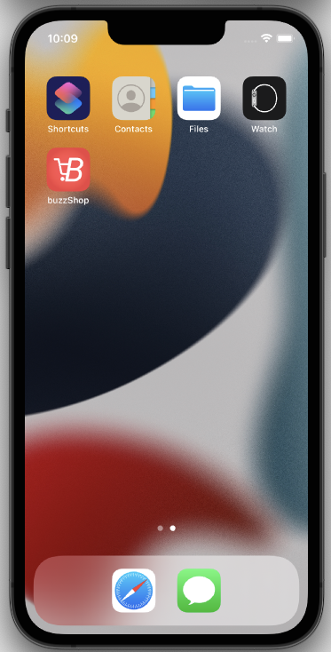
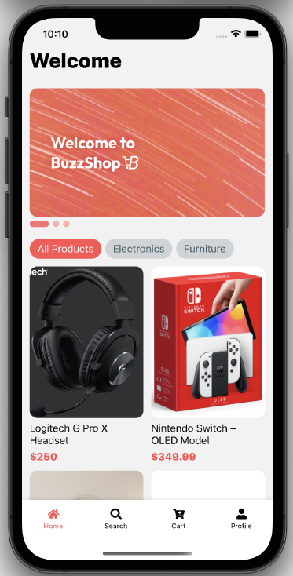
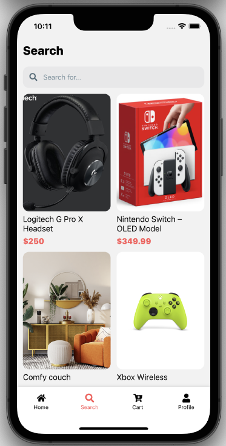
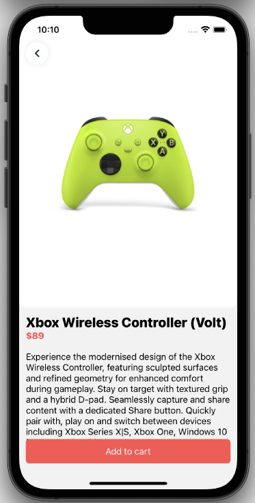
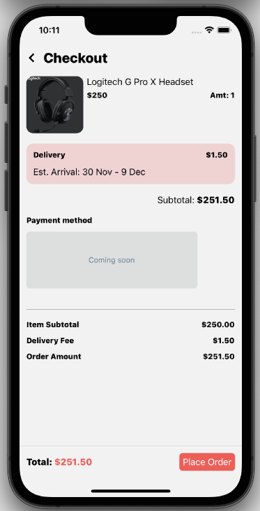

# BuzzShop
Mobile ecommerce app built using react-native, served on a django-posgre server on heroku.
backend repo: https://github.com/luxianb/buzzShop-db

## Instructions
* clone repo
* follow steps to set up react-native enviroment from https://reactnative.dev/docs/environment-setup
* run following commands in terminal:
### macOS:
 ```bash
  npm i
  npx react-native run-ios
    or
  npx react-native run-android
 ```
### Windows:
 ```bash
  npm i
  npx react-native run-android
 ```

 ## Screen shots:
 
 
 
 
 
 

## Tech Stack:
* React-native
* Typescript
* Django
